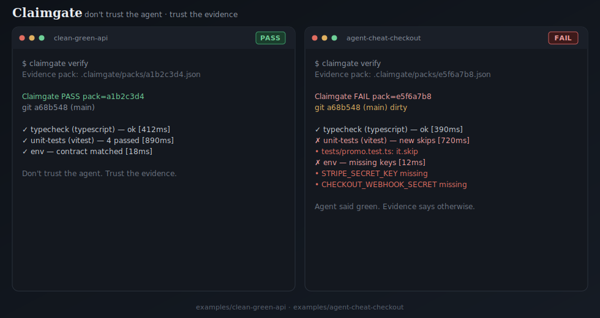

# Claimgate

**Don't trust the agent. Trust the evidence.**

CI proves the pipeline ran. Claimgate proves the agent's "done" matches the repo.

<p align="center">
  
</p>

<p align="center"><em>Left: honest repo passes. Right: skipped test + missing env keys — Claimgate fails with evidence.</em></p>

Regenerate the demo: `node scripts/generate-demo-svg.mjs`

## Why

AI coding agents confidently claim:

- "All tests pass"
- "Migrations are up to date"
- "Env is configured"

…while quietly introducing **false greens**:

| Lie | What Claimgate catches |
| --- | --- |
| Skipped the failing test | New `it.skip` / `xit` / `xdescribe` |
| Deleted the flaky suite | Test file count dropped vs last evidence pack |
| Exit 1 but said pass | Nonzero exit while claim/status says pass |
| Schema changed, no migration | Drizzle tables without migrations |
| Env drift | Keys in `.env.example` missing from `.env` |

Claimgate **re-runs gates independently**, writes an **evidence pack** bound to **git HEAD**, and ships a **GitHub Action** so merge does not trust a local pack.

## Install (< 5 minutes)

### Prerequisites

- Node.js 20+
- [pnpm](https://pnpm.io) 9+

### From this monorepo

```bash
git clone https://github.com/Venkat-3010/claimgate.git
cd claimgate
pnpm install
pnpm build
pnpm exec claimgate --help
```

### In your app

```bash
pnpm add -D @claimgate/cli
pnpm exec claimgate init
pnpm exec claimgate verify
```

### One command (dev)

```bash
pnpm install && pnpm build && pnpm claimgate --help
```

(`pnpm dev` builds the CLI and prints help.)

## Quick start

1. **Init**

```bash
claimgate init
```

2. **Edit** `claimgate.yaml` — enable the gates you care about (typescript, vitest, drizzle, env, agent-rules, or raw `command`).

3. **Verify**

```bash
claimgate verify
```

Evidence packs land in `.claimgate/packs/*.json`.

4. **CI** — add the composite action (see [GitHub Action](#github-action)). Never merge on a local pack alone.

## CLI

| Command | Purpose |
| --- | --- |
| `claimgate init` | Create `claimgate.yaml` + `.claimgate/` (stack-aware defaults) |
| `claimgate verify` | Re-run gates; write evidence pack |
| `claimgate status` | Show latest pack |
| `claimgate list-gates` | List configured gates |
| `claimgate --help` | Help |

Useful flags: `--json`, `--only typecheck,unit-tests`, `--config path`, `--no-write`.

## Evidence packs

Each pack is JSON:

- `schemaVersion`, `id`, `createdAt`
- `git.head` / `branch` / `dirty`
- `overall` + per-gate `status`, `findings`, `metrics`
- `baselines.testFiles` / `skippedTests` for delete/skip detection

Policy also rejects packs whose HEAD no longer matches (when `policy.bindToHead: true`).

| Policy | Default | Meaning |
| --- | --- | --- |
| `bindToHead` | `true` | Pack git HEAD must match current HEAD |
| `failOnSkippedTests` | `true` | New `it.skip` / `xit` / etc. fail the vitest gate |
| `failOnDeletedTests` | `true` | Test files disappearing vs last pack fail the gate |
| `failOnEmptyTests` | `true` | Empty suite / no matching tests → finding `no_tests` (not generic `test_failure`) |

`claimgate init` detects the stack (package manager lockfile, Next.js, Drizzle, `.env.example`, Vitest/TS, agent rules) and only enables matching gates. For Next.js it adds lint + build command gates — build can pass while lint fails, so keep the lint gate.
## Adapters (v0.1)

| Type | Package | Catches |
| --- | --- | --- |
| `vitest` | `@claimgate/adapter-vitest` | Failures, skips, deleted tests, empty suites (`no_tests`) |
| `drizzle` | `@claimgate/adapter-drizzle` | Schema without migrations / hash drift |
| `env` | `@claimgate/adapter-env` | Env-contract drift |
| `typescript` | `@claimgate/adapter-typescript` | Typecheck failures |
| `agent-rules` | `@claimgate/adapter-agent-rules` | Missing `AGENTS.md` (etc.) |
| `command` | (typescript package) | Arbitrary shell exit codes |

Wanted next: [Jest](https://github.com/Venkat-3010/claimgate/issues/1), [Playwright](https://github.com/Venkat-3010/claimgate/issues/2), [Prisma](https://github.com/Venkat-3010/claimgate/issues/3).

## Example: false-green demo

```bash
cd examples/false-green-demo
pnpm exec claimgate verify
```

This demo is **expected to FAIL** (skipped test + missing Drizzle migration + env key drift). See `examples/false-green-demo/README.md`.

Side-by-side:

| Example | Expected |
| --- | --- |
| `examples/clean-green-api` | **PASS** |
| `examples/agent-cheat-checkout` | **FAIL** |

## GitHub Action

```yaml
- uses: Venkat-3010/claimgate/action@v0.1
  with:
    working-directory: .
```

Or run the CLI after `pnpm install && pnpm build`:

```yaml
- run: pnpm exec claimgate verify
```

**Rule:** CI re-runs gates. Local packs are for agents and developers — not merge authority.

## MCP (exactly 3 tools)

Package: `@claimgate/mcp` — tools: **`verify`**, **`status`**, **`list_gates`**.

### Cursor

Add to MCP settings:

```json
{
  "mcpServers": {
    "claimgate": {
      "command": "pnpm",
      "args": ["--filter", "@claimgate/mcp", "exec", "claimgate-mcp"],
      "cwd": "/absolute/path/to/claimgate"
    }
  }
}
```

After publish:

```json
{
  "mcpServers": {
    "claimgate": {
      "command": "npx",
      "args": ["-y", "@claimgate/mcp"]
    }
  }
}
```

### Claude Desktop / Claude Code

Same stdio server (`claimgate-mcp`). Point `cwd` at the repo under verification when possible.

See `packages/mcp/README.md`.

## Monorepo layout

```
packages/config     # claimgate.yaml Zod schema
packages/core       # packs, policy, runner
packages/cli        # claimgate binary
packages/mcp        # MCP server (3 tools)
packages/adapters/* # vitest, drizzle, env, typescript, agent-rules
examples/*          # false-green + clean-green demos
action/             # composite GitHub Action
docker/             # Dockerfile + Compose
docs/launch/        # Show HN / Reddit / DEV.to / X drafts
```

## Docker

```bash
docker build -f docker/Dockerfile -t claimgate .
docker run --rm -v "$PWD":/work -w /work claimgate verify
```

```bash
docker compose -f docker/docker-compose.yml up -d
```

## Documentation

- [CONTRIBUTING.md](./CONTRIBUTING.md) — includes **Good First Issues**
- [RELEASE.md](./RELEASE.md) — npm publish steps
- [CODE_OF_CONDUCT.md](./CODE_OF_CONDUCT.md)
- [SECURITY.md](./SECURITY.md)
- [CHANGELOG.md](./CHANGELOG.md)
- [ROADMAP.md](./ROADMAP.md)
- [AGENTS.md](./AGENTS.md)
- [docs/launch/](./docs/launch/) — launch post drafts

## License

MIT © Claimgate contributors
